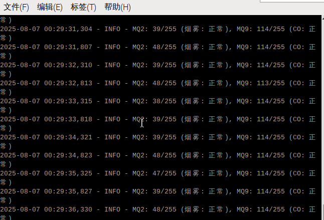
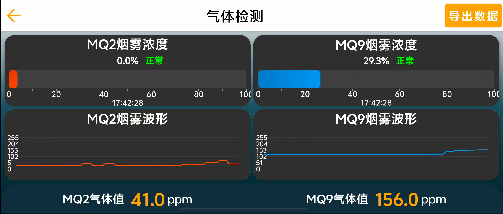

# 树莓派气体检测系统

## 📖 项目简介
本项目基于 **树莓派 4B** 和 **气体传感器模块（MQ-2、MQ-9）**，实现了实时气体浓度检测、阈值报警、WiFi 热点直连以及上位机数据可视化功能。  
系统能够监测 **烟雾浓度（MQ-2）** 和 **一氧化碳浓度（MQ-9）**，在浓度超过设定阈值时触发报警，并通过无线网络将数据实时传输至 Android 手机端进行可视化显示和波形绘制。

---

## 🛠️ 硬件组成
- 树莓派 4B（Raspberry Pi 4B）
- 气体传感器 MQ-2（烟雾检测）
- 气体传感器 MQ-9（一氧化碳检测）
- PCF8591 模拟量采集模块（I²C 接口）
- 树莓派官方 7 寸触摸屏（可选）
- 有源蜂鸣器（高电平触发）

---

## 💻 软件功能
1. **气体数据采集**  
   通过 PCF8591 模块读取 MQ-2、MQ-9 的模拟输出值（0-255）。
   
2. **阈值报警**  
   - MQ-2 烟雾阈值：`180/255`  
   - MQ-9 一氧化碳阈值：`170/255`  
   当超过阈值时，`alert_status` 标志置为 True。

3. **WiFi 热点模式**  
   树莓派启动时自动开启热点（SSID: `GasDetector_Hotspot`，密码: `12345678`），手机可直接连接。

4. **UDP 自动发现 + TCP 数据传输**  
   - UDP 广播设备信息（每 5 秒一次）
   - 上位机 APP 通过 TCP 端口（50000）获取实时气体浓度数据

5. **上位机可视化显示**  
   - 实时浓度百分比显示  
   - 浓度波形曲线绘制  
   - ppm 数值显示  
   - 状态显示（正常 / 触发报警）

---

## 📷 系统运行效果

### 树莓派终端输出


### 手机上位机界面


---

## 📂 代码核心逻辑解析

### 1. 数据读取与报警判断
```python
# 读取 PCF8591 指定通道数据
mq2_raw = read_pcf8591(PCF8591_CHANNEL_MQ2)
mq9_raw = read_pcf8591(PCF8591_CHANNEL_MQ9)

# 更新全局变量
with sensor_data_lock:
    current_mq2_raw = mq2_raw
    current_mq9_raw = mq9_raw

# 阈值判断
alert_status["smoke"] = mq2_raw > MQ2_SMOKE_THRESHOLD
alert_status["co"] = mq9_raw > MQ9_CO_THRESHOLD
